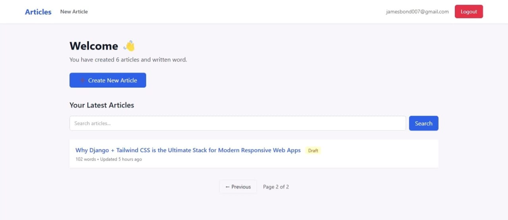
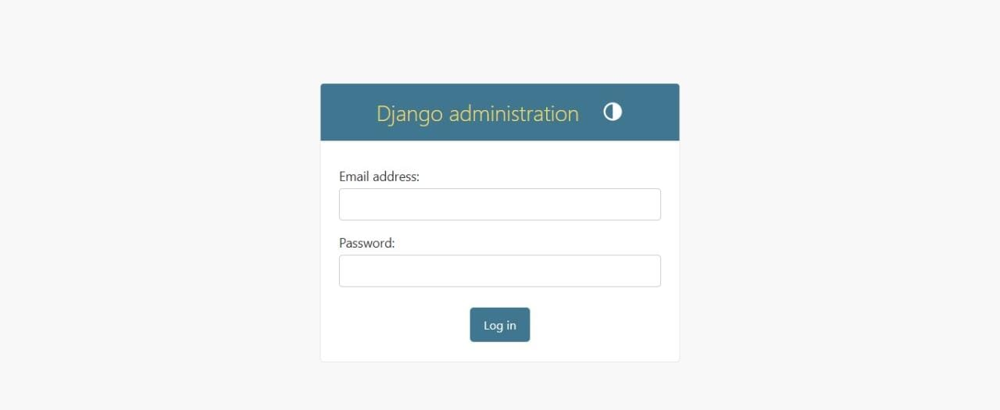

# Django Article Management System

A **production-ready Django web application** that allows users to securely create, edit, publish, and manage articles using a clean, responsive interface.

This project demonstrates **full-stack Django development**, authentication, CRUD operations, and cloud deployment best practices.

---

## 🚀 Features

- User authentication (Login / Signup)
- Secure user-based access control
- Create, edit, delete articles (CRUD operations)
- Draft and Published article workflow
- Word count tracking
- Search functionality
- Pagination for scalable content handling
- Last updated timestamp tracking
- Django Admin dashboard
- Clean and responsive UI using Tailwind CSS

---

## 🛠 Tech Stack

### Backend & Core Technologies
- Python 3
- Django (MVT Architecture, ORM, Class-Based Views)
- Django Allauth (Email-based Authentication & Authorization)
- SQLite (Development Database)

### Frontend & UI
- HTML5
- Tailwind CSS
- Responsive UI Design

### DevOps & Deployment
- Docker
- Docker Compose
- Railway Cloud Deployment
- WhiteNoise (Static File Management)

### Tools & Best Practices
- Git & GitHub (Version Control)
- Environment Variable Management
- Production-ready Django Settings
- Secure Authentication & Authorization

---
## 📸 Screenshots

### Dashboard / Admin Panel
[](screenshots/admin%20panal.jpg)

### Create Article
[](screenshots/create%20articles.jpg)

### Edit Article
[](screenshots/edit%20article.jpg)

### Pagination
[](screenshots/pagination.jpg)

### Search Articles
[](screenshots/search%20articles.jpg)

### Django Admin Panel
[](screenshots/django-adminstration.jpg)
---

## ⚙️ Installation & Setup

### 1. Clone the repository
```bash
git clone https://github.com/YOUR_USERNAME/django-article-management-system.git
